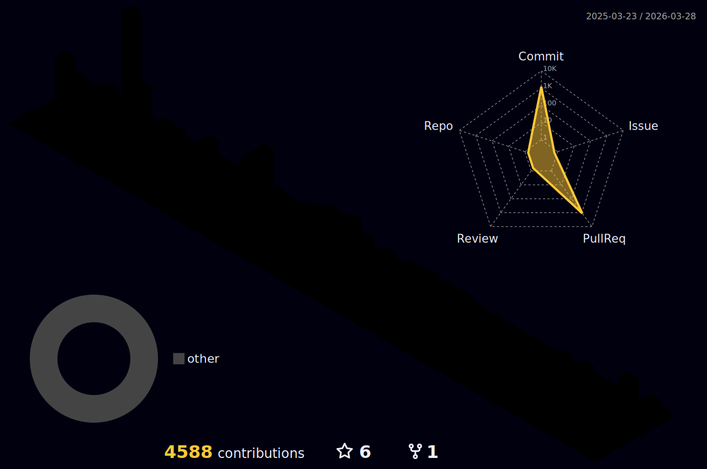

<div align="center">
  
</div>

<hr>

<p align="center">
  <a href="https://github.com/chrisbanas">
    
  </a>
  <a href="https://www.linkedin.com/in/christopher-banas">
    
  </a>
  <a href="https://www.christopherbanas.com">
    
  </a>
  <a href="mailto:banaschg@gmail.com">
    
  </a>
</p>

<h2 align="center">About Me</h2>

```js
class WhoAmI {
  constructor() {
    this.name = "Christopher Banas";
    this.location = "Menlo Park, CA";
    this.currently = [
      "Senior Applied AI Engineer @ ServiceNow",
      "Tech Lead for CPQ on CRM AI Foundry",
      "MCIT Candidate @ University of Pennsylvania"
    ];
    this.focus = [
      "Applied AI solutions",
      "Developer workflows",
      "Automation",
      "Intelligent product experiences",
      "Systems that create leverage"
    ];
    this.highlight = "President's Lifetime Achievement Award recipient";
  }

  about() {
    return `
      I build applied AI solutions that help turn complex business logic into
      useful product experiences. My work sits at the intersection of software
      engineering, automation, demos, integrations, and AI-enabled workflows.

      Right now I'm focused on intelligent CRM experiences, reusable developer
      tooling, and the kind of systems that make teams faster without adding
      noise.
    `;
  }
}
```

<hr>

<h2 align="center">What I'm Focused On</h2>

<p align="center">
  applied ai • crm experiences • developer tools • automation • integrations • system design
</p>

<hr>

<h2 align="center">Selected Highlights</h2>

<p align="center">
  Led CPQ AI work at ServiceNow • Built AI and eCommerce demos for Dreamforce 2024 •
  Created GitHub Actions-based CI/CD for ServiceNow configuration management •
  President's Lifetime Achievement Award recipient
</p>

<hr>

<h2 align="center">Stack</h2>

<p align="center">
  
  
  
  
  
  
  
  
  
  
  
  
</p>

<hr>

<h2 align="center">Dynamic Stack</h2>


<p align="center">
  Tech stack inferred from repositories and commits associated with this account.
</p>


<hr>

<h2 align="center">GitHub Activity</h2>

<picture>
  <source media="(prefers-color-scheme: dark)" srcset="https://raw.githubusercontent.com/chrisbanas/chrisbanas/output/github-contribution-grid-snake-dark.svg" />
  <source media="(prefers-color-scheme: light)" srcset="https://raw.githubusercontent.com/chrisbanas/chrisbanas/output/github-contribution-grid-snake.svg" />
  
</picture>

<hr>

<h2 align="center">Pac-Man Mode</h2>

<picture>
  <source media="(prefers-color-scheme: dark)" srcset="https://raw.githubusercontent.com/chrisbanas/chrisbanas/output/pacman-contribution-graph-dark.svg" />
  <source media="(prefers-color-scheme: light)" srcset="https://raw.githubusercontent.com/chrisbanas/chrisbanas/output/pacman-contribution-graph.svg" />
  
</picture>

<hr>

<h2 align="center">3D Contributions</h2>





<p align="center">
  
</p>

<hr>

<p align="center">
  This README is maintained with GitHub Actions.
</p>
